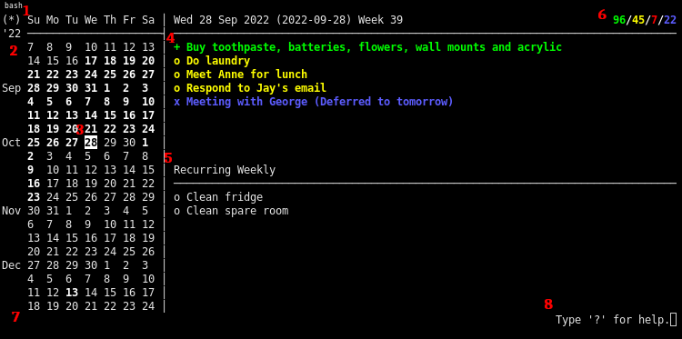

## Overview

This is a personal organization tool that can be used to keep track of events,
goals, and meetings. Here is a screenshot that illustrates what the program
looks like:

<p align="center">
  
<p>

The left pane consists of a calendar that can be navigated using the h, j, k,
and l keys. You can press "Enter" to edit the data associated with that day
using a text editor.

## Key Bindings

This is a comprehensive list of the default key bindings for this program:

| Key              | Action                                            |
|------------------|---------------------------------------------------|
| h, j, k, l       | Move the cursor left, down, up, or right.         |
| i, Space, Return | Edit the day under the cursor.                    |
| s                | Save the data to the `calendar.json` file.        |
| 1-9              | Toggle the indicators next to recurring tasks.    |
| q                | Quit.                                             |
| p                | 'Print' the calendar using the print script.      |
| 0                | Move the cursor to the current day.               |
| d                | Delete the data for the day under the cursor.     |
| r                | Edit the recurring task for that day of the week. |
| e                | Cycles views in the calendar pane.                |
| /                | Search for a string in day data using regex.      |
| \                | Same as '/', but is case insensitive.             |
| Cursor keys      | Scroll the calendar.                              |

## Usage

The terminal calendar can be invoked as described in the usage statement:

```
Usage: terminal_calendar [options]
 -c,--command   The command to be run when "printing" (default `./print.sh`).
 -e,--editor    The command representing the text editor to use (default vim).
 -f,--file      Calendar file to use. Default "calendar.json".
 -h,--help      Print this usage message.
 -l,--log-file  The name of the log file to be used.
 -n,--no-clear  Do not clear the screen on shutdown.
 -o,--lock-file The name of the lock file to be used (default /tmp/termcal.lock).
 -v,--verbose   Display additional logging information.
```

Users can also configure the editor by setting the `EDITOR` environment
variable.

## Dependencies

These are the dependencies for terminal-calendar:

```
gcc
libcjson-dev
libncurses-dev
make
some editor (default nvim)
```

## License

This work is licensed under the GNU General Public License version 3 (GPLv3).

[](https://www.gnu.org/licenses/gpl-3.0.en.html)
