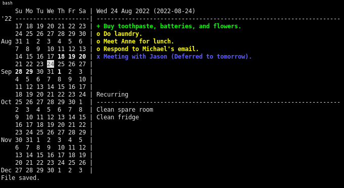

## Overview

This is a personal organization tool that can be used to keep track of events,
goals, and meetings. Here is a screenshot that illustrates what the program
looks like:

<p align="center">
  
<p>

## Key Bindings

## Usage

The terminal calendar can be invoked as described in the usage statement:

```
Usage: terminal_calendar [options]
 -f,--file      Calendar file to use. Default "calendar.json".
 -h,--help      Print this usage message.
 -n,--no-clear  Do not clear the screen on shutdown.
 -v,--verbose   Display additional logging information.
```

## Dependencies

These are the dependencies for terminal-calendar:

```
gcc
libcjson-dev
libncurses-dev
make
some editor (default nvim)
```

## License

This work is licensed under the GNU General Public License version 3 (GPLv3).

[](https://www.gnu.org/licenses/gpl-3.0.en.html)
